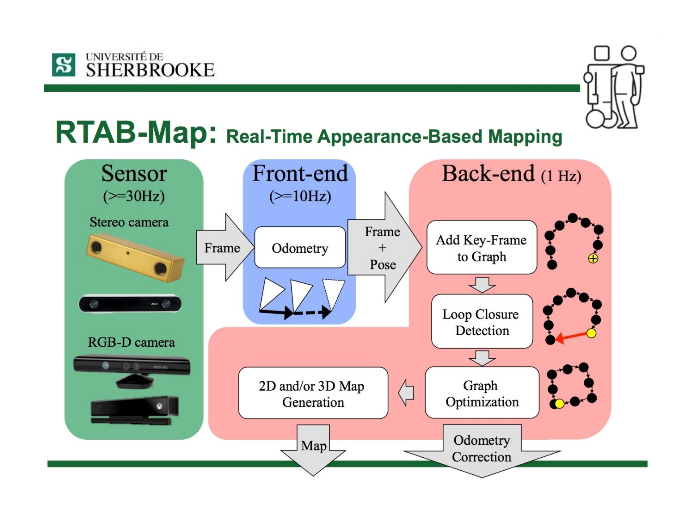
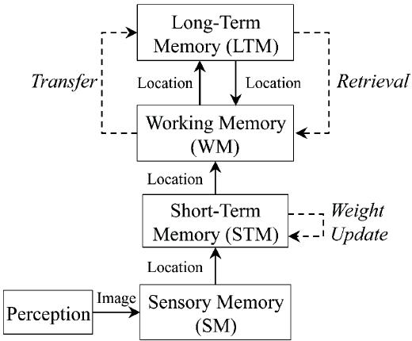

# RTABMAP

Implementation of 3D mapping using Kinect and RGB-D Camera sensors in an indoor environment. Real-time appearance-based mapping (RTAB-Map) was used to make the 3D map simulated in the Gazebo environment.

# INTRODUCTION
RTAB-Map stands for Real-Time Appearance-Based Mapping. It is a Graph based SLAM approach based on appearance-based loop closure detection. It checks how likely an image comes from the previous location. Graph SLAMs have better accuracy than FAST SLAM. Here, we used RTAB-Map with Kinect only for 6DoF mapping. Kinect is a stereo vision sensor with depth camera to determine the depth instantaneously thereby saving estimating computation. Appearance based SLAM means that the algorithm will use the data obtained from vision sensors to localize the position of the robot and simultaneously map the robot in the environment. Loop Closures are used to determine if the robot has already seen the particular frame before. Local Loop closure is dependent of Visual Odometry whereas Global Loop Closure is independent of the estimated pose that’s visual odometry. Thus, when the robot moves, the map expands and the number of images that is compared increases in turn. It thus creates dense maps unlike ORB SLAM.

# WORKING OF RTAB-MAP

RTAB-Map uses depth image with RGB images to construct maps. The graph is created here, where each node contains RBG and depth images with corresponding odometry pose. The links are transformation between each node. When the graph is updated, RTAB-Map compares the new image with all previous ones in the graph to find a loop closure. When a loop closure is found, graph optimization is done to correct the poses in the graph. For each node in the graph, we generate a point cloud from the RGB and depth images. This point cloud is transformed using the pose in the node. The 3D map is then created.

The above image shows the memory management technique adapted by RTAB-Map. We know that when our robot has to map large environments, the computation increases as the loop closure stores and checks through a hefty database. Thus, for real-time applications, RTAB-Map will become too expensive and less robust. Thus, a memory management method has been adopted to make RTAB-Map robust and usable in large environments in real-time as well. So, the flow is as follows, perception module to sensory memory from where no subsequent frames are passed to the working memory considering high probability to get similar frames. Based on the location similarity weights are updated for the respective frames. If the loop closure in the takes more time a transfer method is adapted wherein old weighted locations are sent to the long-term memory. Thus, in LTM map is thus stored. Then, new locations are again checked similar to the process as mentioned above. If a old frame matches with the new location then retrieval of the old frame takes place. It will then be fused with the graph map made previously thereby creating the global map. 

# WORK PROGRESS
<ul>
  <li>The custom robot URDF made was put in a world using Gazebo environment.</li>
  <li>For visualizing in 3d opened RViz. </li>
  <li>RTAB-Map was initiated.</li>
  <li>Teleop script was called for mapping (We used teleop purposely to repeat at places where mapping didn’t precisely occur). Also, an autonomous mapping code has been given in repo.</li> 
</ul>

# REFERENCES

[1]. N. Altuntaş, E. Uslu, F. Çakmak, M. F. Amasyalı and S. Yavuz, "Comparison of 3-dimensional SLAM systems: RTAB-Map vs. Kintinuous,".

[2]. Mathieu Labbé, François Michaud RTAB‐Map as an open‐source lidar and visual simultaneous localization and mapping library for large‐scale and long‐term online operation

[3]. Sagarnil Das Simultaneous Localization and Mapping (SLAM) using RTAB-Map

[4]. Mathieu Labbé Simultaneous Localization and Mapping (SLAM) with RTAB-Map https://introlab.3it.usherbrooke.ca/mediawiki-introlab/images/3/31/Labbe2015ULaval.pdf
